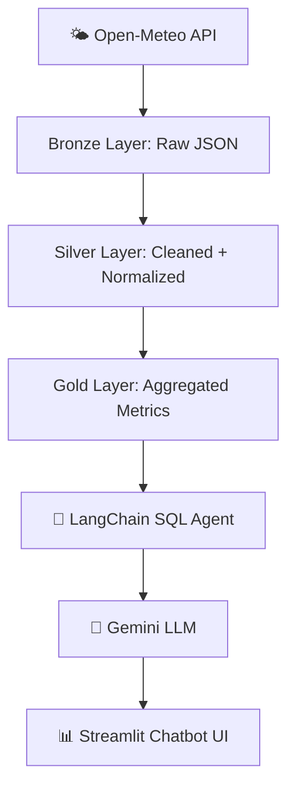

# 🌤️ Weather Intelligence Pipeline (PySpark · Delta Lake · Unity Catalog · Databricks · LangChain · Gemini)

[](./workflows/databricks_job_setup.md)


---

## 📘 Overview

This project implements a **distributed, AI-augmented ETL and analytics system** for weather data using **PySpark**, **Delta Lake**, and **Databricks Workflows** — now extended with an **LLM-powered chatbot** built using **LangChain**, **Google Gemini**, and **Streamlit**.

The system automates ingestion, transformation, and aggregation of weather data into **Unity Catalog–governed Delta tables**, and exposes it through a **conversational chatbot interface** that allows natural-language queries over curated Gold data.

---

## ⚙️ Key Features

✅ End-to-end ETL (Extract → Transform → Load) on Databricks  
✅ Delta Lake ACID storage under Unity Catalog  
✅ YAML-based configuration for full reproducibility  
✅ Managed orchestration via Databricks Workflows  
✅ **Conversational Query Interface** — LangChain + Gemini + Databricks SQL  
✅ Streamlit front-end for interactive analytics and visualization  
✅ **Dockerized** environment for local reproducibility  
✅ Optional Airflow DAG for hybrid orchestration  
✅ Automatic retries + email alerts on failure  

---

## 🧩 Architecture

```
          🌐 Open-Meteo REST API
                    │
                    ▼
     ┌──────────────────────────────┐
     │   Bronze Layer (Raw)         │ → main.weather_etl.raw_weather
     └──────────────────────────────┘
                    │
                    ▼
     ┌──────────────────────────────┐
     │   Silver Layer (Curated)     │ → main.weather_etl.silver_weather_curated
     └──────────────────────────────┘
                    │
                    ▼
     ┌──────────────────────────────┐
     │   Gold Layer (Aggregated)    │ → main.weather_etl.gold_weather_aggregates
     └──────────────────────────────┘
                    │
                    ▼
     ┌────────────────────────────────────────────────────────┐
     │   LLM Chatbot Layer (LangChain + Gemini + Streamlit)   │
     │   ▸ Natural Language → SQL → Databricks Unity Catalog  │
     │   ▸ Query visualization (temperature & humidity trends)│
     └────────────────────────────────────────────────────────┘
```

---

## 🧠 System Flow (Mermaid Diagram)



---

## 🧱 Tech Stack

| Category | Tools |
|-----------|-------|
| Language | Python 3 · PySpark |
| Storage | Delta Lake |
| Governance | Unity Catalog |
| Orchestration | Databricks Workflows |
| AI / LLM | LangChain · Google Gemini (Generative AI) |
| Frontend | Streamlit |
| Cloud | Azure Databricks |
| Version Control | Git + GitHub |
| Optional | Airflow DAG · Docker |

---

## 🧠 Chatbot Layer Overview

| Component | Description |
|------------|-------------|
| **LLM Backend** | Google Gemini (via `google-generativeai`) |
| **Framework** | LangChain SQL Agent (`create_sql_agent`) |
| **Data Source** | Databricks Unity Catalog Gold table (`main.weather_etl.gold_weather_aggregates`) |
| **Frontend** | Streamlit UI (`src/chatbot/app.py`) |
| **Environment Variables** | Managed via `.env` (`connection.env`) |
| **Query Flow** | User query → LangChain Agent → Databricks SQL → Response / Chart |

---

## 📂 Repository Structure

```
spark-etl/
├── config/
│   └── config.yaml
├── src/
│   ├── ETL/
│   └── chatbot/
│       ├── agent_unity_gemini.py
│       └── app.py
├── workflows/
│   ├── pipeline.json
│   ├── pipeline_readme.md
│   └── pipeline_airflow.py
├── notebooks/
│   ├── Extract Data
│   ├── Transform Data
│   └── Load Data
├── requirements.txt
└── README.md
```

---

## ⚡ Databricks Workflow

**Job Name:** `Weather_ETL_Pipeline`

| Setting | Value |
|----------|--------|
| Scheduled | yes |
| Retry | 1 retry after 1 minute |
| Email Alert | `ziaarzoo21@gmail.com` |
| Concurrency | 1 active run |
| Queuing | ✅ Enabled |
| Performance Target | `PERFORMANCE_OPTIMIZED` |

**DAG Flow:**
```
Extract_Raw → Transform_Silver → Load_Gold
```

---

## 💬 Running the Chatbot

### 🖥️ Local (Recommended)

```bash
streamlit run src/chatbot/app.py
```

Then open → [http://localhost:8501](http://localhost:8501)

---

### 🧱 Inside Databricks (Debug Mode)

```python
from src.chatbot.agent_unity_gemini import query_agent
print(query_agent("Show average temperature by month"))
```

---

## 🧱 Example Queries

- “Show average humidity trend by month.”  
- “Which month had the highest rainfall?”  
- “Give me total precipitation by year.”  
- “Plot average temperature across all months.”  

---

## 🧾 Example Output

✅ **Natural-language query → SQL translation → Databricks → Gemini response**

```
User: What was the average temperature in June 2024?
Gemini: The average temperature recorded in June 2024 was 29.6 °C.
```

If the query is numeric and tabular, Streamlit automatically displays a **line chart** of the trend.

---

## 🧠 Development Flow

1. Update ETL or chatbot code in Databricks Repos  
2. Commit and push to GitHub  
3. If the workflow changes, re-export `pipeline.json`  
4. Run job manually or on schedule  
5. Test chatbot on updated Gold data  

---

## 🏁 Author

**Md Zia Arzoo** — Software Developer  
Building distributed and intelligent data systems using PySpark, Databricks, and AI-powered analytics.
